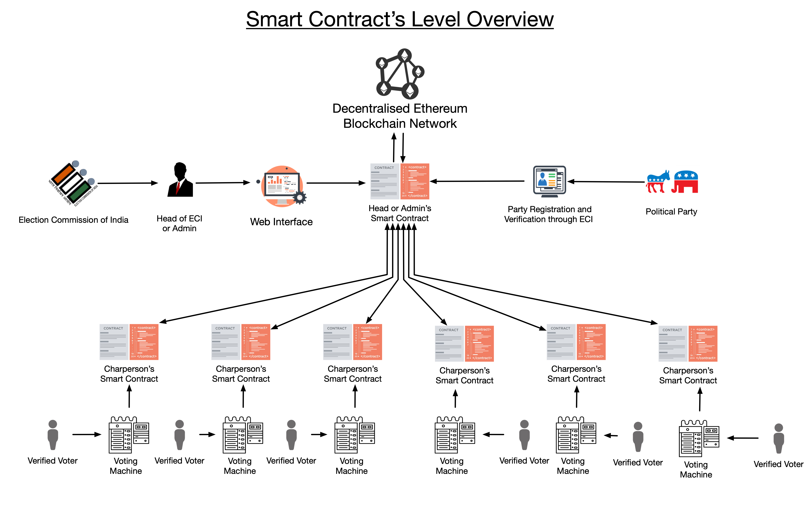
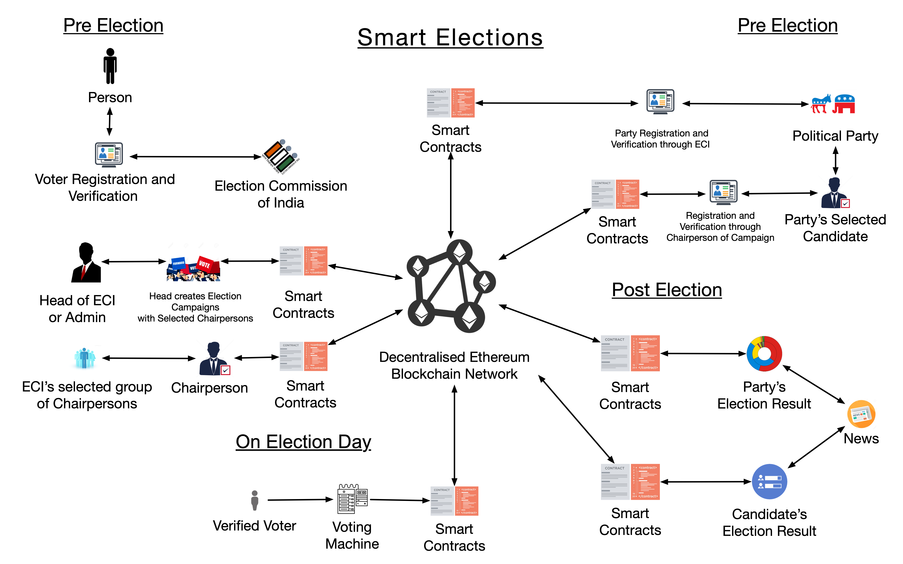

# Smart Elections
## A Blockchain based solution for temperproof elections.
#### Project by Team Pro at I_HACK Hackathon E-Summit'19 IIT Bombay
### This repository **decentralized-Dapp-Server** is main server for Smart Contract, API, Database, UI-Result

Smart Elections is a voting system based on Decentralised Ethereum Blockchain Network. An attempt to improve India's current election system using Ethereum Blockchain Network.

  - NO more Biasing in votes
  -  The authenticity to every voter and candidate via Smart Transaction
  - Votes are decentralized and distributed across a peer-to-peer network for security

## Problem statement:
> **India's EVMs are Vulnerable to Fraud**
> A research [article](https://indiaevm.org/qa.html) have claimed many ways to temper vote.

> **The question arises - why we even do voting in India?**
> Some temper proof solution needs to be made for secure and fair Elections and Voting,
> So that user is sure their vote is not being tempered,
> We came up with this great solution  


Our project uses Blockchain and Smart Etherum contracts to make sure each and every vote is being stored peer to peer in a decentralized network with Hashing so that every vote is secured and elections are fair

## Simple Steps :
 1)  **Verify User** - Use some Biometric user verification (currently not implemeneted)
 2)  **Take Vote** - Take vote via IOT devce based on rasberry Pi 3 
 3)  **Make Smart Contract** - Store the vote via Smart-Contract in Etherum network 
 4)  **Results** - Count the total votes in network 


## Complete project :-
Being a large and team project there are multiple repositories for individual stack and field

 - #### [decentralized-Dapp-Server](https://github.com/siddharthshah3030/decentralized-Dapp-Server)(this)- main server for Smart Contract, API, Database, UI-Result  
 
- #### [Smart-Elections_Solidity](https://github.com/Shritesh99/Smart-Elections_Solidity) - consists of etherum side smart contract code

- #### [Smart_elections_rasp](https://github.com/utkarshchandrakar/Smart_elections_rasp) - voting machine based on Raspberry Pi 3 for taking votes from voters

 -  #### [Smart-Elections-Server](https://github.com/siddharthshah3030/Smart-Elections-Server) - old main server (Smart Contract, API, Database, UI-Result)




## Features
 - Registration - of voters and candidates with respective campaigns
 - Verification and Voting - of candidates on election
 - Results - check out major and individual campaigns statistics of votes

## Tech

Dapp server uses some projects to work properly:
* [Mongoose] - Object modelling and handling
* [Faker] - Generating dummy data
* [Web3] - Interact with remote ethereum node 
* [EtherJs] -  Ethereum wallet implementation and utilities


## Installation 

(This repository and main server)
Install the dependencies and start the server.
```sh
$ cd decentralized-Dapp-Server
$ yarn install
$ yarn start
```
## Development

 -  The data-base is connected to Mlabs and already seeded
To seed the database just run the below files
    ```sh
    data/seedParty.js
    data/seedVoter.js
    data/seedCandidate.js
    ```
    OR 
    use data/main.js and uncomment line 30,31,32 (recommended)
- You will need connection and addresses for etherum network too
    check [this](https://github.com/Shritesh99/Smart-Elections_Solidity) for info 
- A UI or IOT to take input and make server call (check [this](https://github.com/utkarshchandrakar/Smart_elections_rasp) for IOT)
### Contribute

Want to contribute? Great!
just make an issue and we'll respond
or better just make a PR

# Contributors
- [Siddharth](https://github.com/siddharthshah3030) 
- [Shritesh](https://github.com/Shritesh99)
- [Utkarsh](https://github.com/utkarshchandrakar)
- [Nagendra](https://github.com/njha1999)


License
----

MIT

